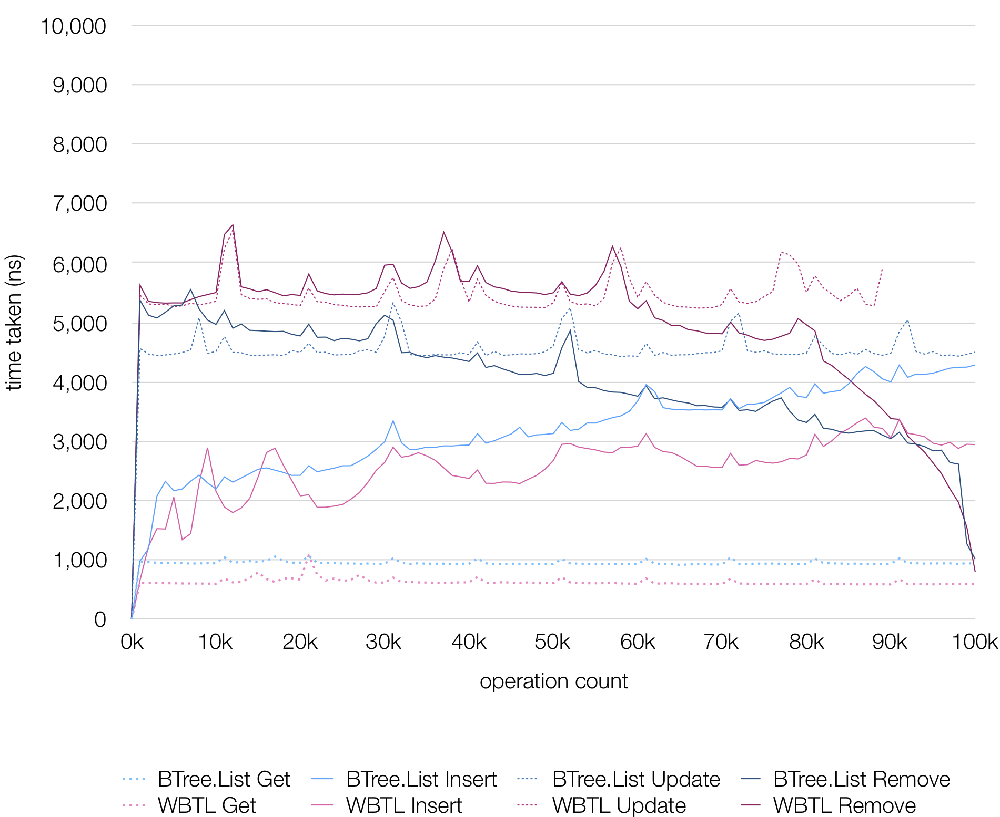
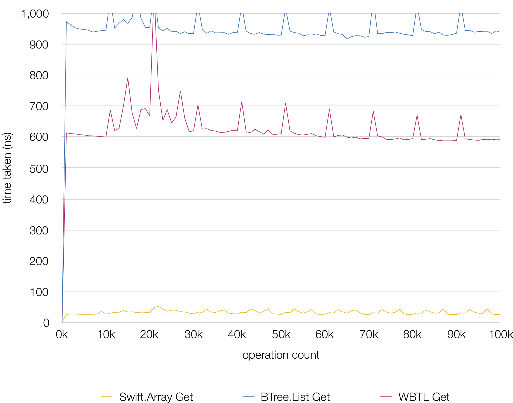

WBTL
=====
Eonil, 2019.

An implementation of Weighted B-Tree based List for Swift.

`WBTL` provides these features.

- Standard `Swift.Array`-like interface.
- All core operations take `O(log(n))` time.
- Automatic weight aggregation.
- Find by weight-offset also takes `O(log(n))` time.
- Full Copy-on-Write support for copy-persistence.
- Comparable performance with other B-Tree libraries.
- Plain collection types without weighting operation.
- "MIT License"d.

Getting Started
------------------
Use `WBTL` type. This type provides these array-like interfaces.

- `RandomAccessCollection`
- `MutableCollection`
- `RangeReplaceableCollection`
- `ExpressibleByArrayLiteral`.

Use `index(for:)` method to find an element for weight offset.

Weighted?
-------------
Internally, `WBTL` is implemented using B-Tree. 
Most core operations takes `O(log(n))` time.

"weighted" means each nodes keeps `weight` value and aggregates
them for each time elements get inserted and removed.

How is it Useful?
-------------------
Sometimes we need to aggregate values in specific range quickly.
For example, let's say that you have multiple boxes with these widths. 

    let widths = [100, 200, 300, 600, 100]
    
Total length is `700`. If you want to find a box at `400` from left, 
you need to iterate and add all values until you find the value
and this takes `O(n)`.

    let target = 400
    for i in widths.indices.dropLast() {
        let n = widths[i]
        let n1 = widths[i+1]
        if (n..<n1).contains(target) {
            return i
        }
    }
    fatalError("Out of range.")

With `WBTL`, you can do this in `O(log(n))` time.

    let target = 400
    let widths = [100, 200, 300, 600, 100] as WBTL
    let i = widths.index(for: target)

Non-Weighted Applications?
-----------------------------------
If you don't want or need weight aggregation, use `BTL` type that eliminates
weighting operations time and cost to zero.

Copy-on-Write
------------------
`WBTL` is fully copy-on-write and optimized for copy-persistent scenario.

Performance
---------------
All core operations takes `O(log(n))` time and about 20x-200x slower than
ephemeral `Swift.Array` operations.

Overall performance is comparable with B-Tree by Károly Lőrentey.

Get by index performance is slightly better than B-Tree by Károly Lőrentey.

Credits & License
----------------------
Copyright(c) Eonil, Hoon H.. All rights reserved.
Source code is licensed under "MIT License".
