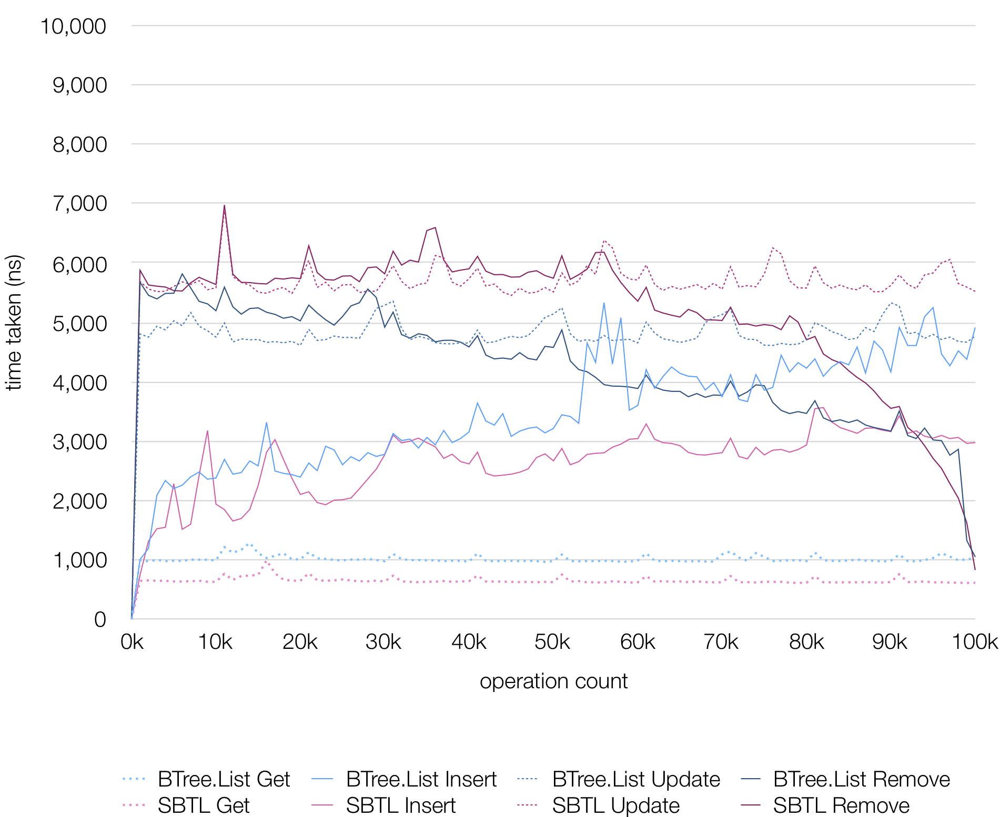
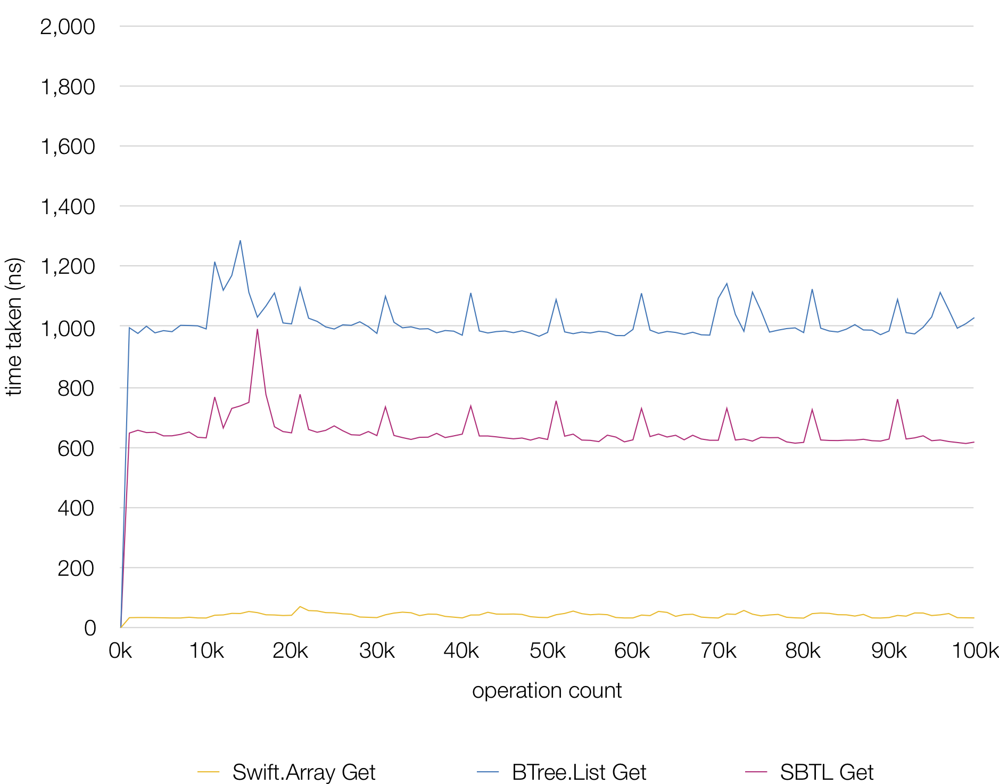

SBTL
=====
Eonil, 2019.

An implementation of Summation B-Tree based List for Swift.

`SBTL` provides these features.

- Standard `Swift.Array`-like interface.
- All core operations take `O(log(n))` time.
- Automatic subtree value summation.
- Find element index by sum-offset also takes `O(log(n))` time.
- Full Copy-on-Write support for copy-persistence.
- Comparable performance with other B-Tree libraries.
- Plain collection types without summation operation.
- "MIT License"d.

Getting Started
------------------
Use `SBTL` type. This type provides these array-like interfaces.

- `RandomAccessCollection`
- `MutableCollection`
- `RangeReplaceableCollection`
- `ExpressibleByArrayLiteral`
- `Equatable where Element: Equatable`

Use `index(for:)` method to find an element for sum offset.

Summation?
---------------
Internally, `SBTL` is implemented using B-Tree. 
Most core operations takes `O(log(n))` time.

"summation" means each nodes keeps summation of all nodes in the subtree
for each time elements get inserted and removed.

How is it Useful?
-------------------
Sometimes we need to aggregate values in specific range quickly.
For example, let's say that you have multiple boxes with these widths. 

    let widths = [100, 200, 300]
    
Total length is `600`. If you want to find a box at `188` from left, 
you need to iterate and add all values until you find the value
and this takes `O(n)`.

    let target = 188
    for i in widths.indices.dropLast() {
        let n = widths[i]
        let n1 = widths[i+1]
        if (n..<n1).contains(target) {
            return i
        }
    }
    fatalError("Out of range.")

With `SBTL`, you can do this in `O(log(n))` time.

    let target = 188
    let widths = [100, 200, 300] as SBTL
    let (index,offset) = widths.indexAndOffset(for: target)
    // index == 1
    // offset == 88

This query follows standard index inclusion-exclision rules.
- Query for `0` returns `(0,0)`.
- Query for `99` returns `(0,99)`.
- Query for `100` returns `(1,0)`.

Copy-on-Write
------------------
`SBTL` is fully copy-on-write ready, and optimized for copy-persistent scenario.

Performance
---------------
All core operations takes `O(log(n))` time and about 20x-200x slower than
ephemeral `Swift.Array` operations.

Overall performance is comparable with B-Tree by Károly Lőrentey.

Get by index performance is slightly better than B-Tree by Károly Lőrentey.

See Also
-----------
- [B-Tree by Károly Lőrentey](https://github.com/attaswift/BTree).
- [HAMT by Eonil](https://github.com/eonil/swift-hamt).

Credits & License
----------------------
Copyright(c) Eonil, Hoon H.. All rights reserved.
Source code is licensed under "MIT License".
